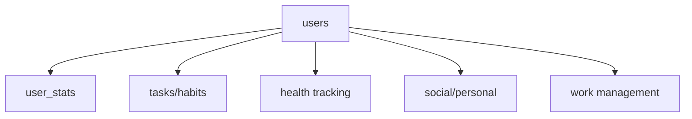

# User Profile Page Specification

## 📋 Overview
A comprehensive dashboard displaying user statistics, progress metrics, and activity summaries in a mobile application. The design emphasizes clarity, interactivity, and visual engagement through a column-based graph system and distinct metric sections.

## Tech Stack
- Frontend: javascript, ejs
- Backend: node.js, express.js
- Database: MySQL

## 💾 Database Schema

### Core Tables

#### 👤 User Management
| Table | Purpose | Key Columns |
|-------|---------|-------------|
| `users` | Account info | `user_id`, `username`, `email` |
| `user_stats` | Attribute metrics | `stat_name`, `stat_value` (0-100) |

#### 📊 Progress Tracking
| Table | Purpose | Key Columns |
|-------|---------|-------------|
| `tasks` | Todo management | `task`, `completed`, `category` |
| `habits` | Habit tracking | `habit`, `completed`, `category` |
| `books` | Reading progress | `title`, `completed`, `date_added` |
| `reading_progress` | Daily reading | `pages_read`, `minutes_read` |

#### 💪 Health & Fitness
| Table | Purpose | Key Columns |
|-------|---------|-------------|
| `exercises` | Exercise types | `exercise_name`, `active` |
| `workouts_calendar` | Workout scheduling | `date`, `category`, `is_completed` |
| `sets` | Exercise details | `workout_id`, `set1`-`set5` |
| `calorie_logs` | Nutrition tracking | `calories`, `fat`, `carbs`, `protein` |
| `meditation` | Mindfulness | `date`, `minutes` |

#### 🤝 Social & Personal
| Table | Purpose | Key Columns |
|-------|---------|-------------|
| `social` | Event tracking | `event_name`, `date`, `time` |
| `people` | Contact management | `name`, `birthday` |
| `gifts` | Gift planning | `person_id`, `gift_name` |

#### 💼 Work & Time Management
| Table | Purpose | Key Columns |
|-------|---------|-------------|
| `work_deadlines` | Deadline tracking | `deadline`, `date`, `completed` |
| `time_off` | Leave management | `type`, `start_date`, `end_date` |

### Key Relationships


### Implementation Notes

#### 🔑 Primary Keys
- All tables use auto-incrementing IDs
- Format: `table_name_id` or `id`
- Type: `BIGINT UNSIGNED`

#### 🔗 Foreign Keys
- `user_id` links to `users.user_id`
- Enforce referential integrity
- Include appropriate indexes

#### 📅 Temporal Data
- Use `DATETIME` for timestamps
- `created_at`, `updated_at` where relevant
- Store dates in UTC

#### 🔍 Common Queries
```sql
-- Get user's current stats
SELECT stat_name, stat_value 
FROM user_stats 
WHERE user_id = ? 
  AND updated_at >= DATE_SUB(NOW(), INTERVAL 30 DAY);

-- Calculate task completion rate
SELECT 
  COUNT(CASE WHEN completed = 1 THEN 1 END) * 100.0 / COUNT(*) 
FROM tasks 
WHERE user_id = ? 
  AND created_at >= DATE_SUB(NOW(), INTERVAL 30 DAY);
```

> **Reference Date**: March 18, 2025

## 📱 Page Layout

### 1. Header
| Element | Specification |
|---------|---------------|
| Username | - Centered, 24pt bold font |
|         | - Optional avatar/initials |
| Style   | - Distinct background/gradient |
|         | - Adequate padding |

### 2. Core Stats Graph
- **Display**: Vertical column chart
- **Metrics**:
  ```
  - Strength
  - Speed
  - Mental
  - Social
  - Work
  - Agility
  - Financial
  ```
- **Implementation**:
  - Scale: 0-100 for each metric
  - Unique colors per attribute
  - Interactive tooltips
  - Responsive sizing
  - Legend (space permitting)

### 3. Progress Tracking
#### Task Completion
- Circular/horizontal progress indicator
- Monthly completion percentage
- Formula: `(completed / total) * 100`

#### Habit Tracking
- Matching progress indicator style
- Monthly completion percentage
- Formula: `(completed instances / expected instances) * 100`

### 4. Health Dashboard
| Metric | Display | Details |
|--------|---------|---------|
| Calories | Numeric | Monthly total (e.g., "42,500 kcal") |
| Workouts | Counter | Monthly sessions (e.g., "12 workouts") |

### 5. Personal Growth
| Metric | Display | Details |
|--------|---------|---------|
| Books | Counter | Monthly total (e.g., "3 books") |
| Meditation | Duration | Monthly minutes (e.g., "450 min") |

## 🔧 Technical Implementation

### API Structure
```json
{
  "GET /user/profile": {
    "response": {
      "username": "string",
      "stats": {
        "strength": "number",
        "speed": "number",
        "mental": "number",
        "social": "number",
        "work": "number",
        "agility": "number",
        "financial": "number"
      },
      "tasks": {
        "completed": "number",
        "total": "number"
      },
      "habits": {
        "completed": "number",
        "total": "number"
      },
      "health": {
        "calories": "number",
        "workouts": "number"
      },
      "growth": {
        "books": "number",
        "meditation_minutes": "number"
      }
    }
  }
}
```

### Frontend Requirements

#### 📊 Data Visualization
- **Charts**: Platform-specific libraries
  - Web: Chart.js
  - Android: MPAndroidChart
  - iOS: Charts
- **Progress Indicators**: Native components preferred

#### 🔄 Data Management
- Load: Page initialization
- Refresh: Pull-to-refresh gesture
- Real-time: WebSocket updates (optional)

#### 📱 Responsive Design
| Screen | Layout |
|--------|---------|
| Mobile | Vertical stack |
| Tablet | Two-column grid |
| Desktop | Multi-column layout |

### Error Handling
